# MCP Open Discovery v2.0 🚀🔥

### **WORLD'S FIRST DYNAMIC MCP TOOL REGISTRY WITH HOT-RELOAD**

<div align="left">
  
</div>

**The most advanced infrastructure discovery and CMDB platform delivering 61 DYNAMIC tools through the official Model Context Protocol (MCP) SDK. Features revolutionary hot-reload capabilities, runtime module management, and persistent SQLite registry. Built for AI assistants, automation systems, and enterprise infrastructure management.**

<br clear="left">

[](./docs/DYNAMIC_REGISTRY.md)
[](./docs/DYNAMIC_REGISTRY.md)
[](#-tool-categories)
[](#-dynamic-registry-features)
[](https://modelcontextprotocol.io)
[](./tools/dynamic_registry_db.js)

---

## 🔥 **REVOLUTIONARY BREAKTHROUGH: Dynamic Tool Registry**

### **Phase 3 COMPLETE: Hot-Reload & Runtime Management**

**WE'VE ACHIEVED THE IMPOSSIBLE!** The world's first MCP server with:

🎯 **RUNTIME MODULE LOADING** - Load new tool modules without server restart  
🔄 **HOT-RELOAD CAPABILITIES** - File watchers automatically reload changed modules  
🗄️ **PERSISTENT REGISTRY** - SQLite database tracks all modules, tools, and analytics  
⚡ **DYNAMIC MANAGEMENT** - 5 new MCP tools to manage the registry itself  
📊 **REAL-TIME TRACKING** - Live module status, tool counts, and load analytics

```bash
# 🔥 THESE TOOLS CAN MANAGE THEMSELVES AT RUNTIME! 🔥
registry_get_status       # Get registry status & hot-reload info
registry_load_module      # Dynamically load new modules
registry_unload_module    # Remove modules and their tools
registry_reload_module    # Hot-reload modules with updated code
registry_toggle_hotreload # Enable/disable hot-reload system-wide
```

### **Database-Driven Architecture:**

- **Module History** - Every load, unload, and reload tracked
- **Tool Analytics** - Usage patterns and registration metrics
- **Configuration Management** - Runtime settings and hot-reload preferences
- **Dependency Tracking** - Module relationships and load order

---

## 🎯 **Key Achievements**

- **🔥 WORLD'S FIRST DYNAMIC MCP REGISTRY** - Runtime module loading with hot-reload
- **✅ 100% Tool Success Rate** - All 61 tools working perfectly including dynamic management
- **🗄️ SQLite Registry Database** - Persistent tracking of modules, tools, and analytics
- **⚡ Zero-Downtime Module Updates** - Hot-reload modules without server restart
- **🔄 Self-Managing Tools** - MCP tools that can manage the registry itself
- **✅ Production Validated** - Successfully tested with 6-node Proxmox cluster
- **✅ Enterprise Grade** - Secure credential management, ITIL v4 CMDB standards
- **✅ AI-Ready Infrastructure Analysis** - Professional prompts for infrastructure assessment

---

## 🏗️ **Revolutionary Architecture**

```mermaid
---
id: 70ab8892-f07a-436f-b361-8c105dd95852
---
flowchart TB
    subgraph DynamicCore["🔥 Dynamic Registry Core"]
        direction TB
        Tracker[("🎯 Registration<br/>Tracker")]
        HotReload[("🔄 Hot-Reload<br/>Engine")]
        Analytics[("📊 Analytics<br/>Dashboard")]
    end

    subgraph Persistence["🗄️ Persistence Layer"]
        direction TB
        SQLite[("💾 SQLite<br/>Registry DB")]
        ModuleHistory[("📋 Module<br/>History")]
        ToolStats[("📈 Tool<br/>Statistics")]
    end

    subgraph Security["🔐 Security & Access"]
        direction TB
        CredManager[("🔐 Credential<br/>Manager")]
        Encryption[("🛡️ AES-256<br/>Encryption")]
        AuditTrails[("📝 Audit<br/>Trails")]
    end

    subgraph Runtime["⚡ Runtime Management"]
        direction TB
        ModuleLoader[("📦 Module<br/>Loader")]
        FileWatcher[("👁️ File<br/>Watcher")]
        ModuleCache[("💨 Module<br/>Cache")]
    end

    subgraph ToolModules["🛠️ Tool Modules - 61 Dynamic Tools"]
        direction LR
        RegTools[("🔥 Registry<br/>5 Tools")]
        MemoryTools[("🧠 Memory CMDB<br/>8 Tools")]
        NetworkTools[("🌐 Network<br/>9 Tools")]
        ProxmoxTools[("🏗️ Proxmox<br/>10 Tools")]
        SNMPTools[("📡 SNMP<br/>12 Tools")]
        ZabbixTools[("🖥️ Zabbix<br/>7 Tools")]
        NMAPTools[("🔍 NMAP<br/>5 Tools")]
        CredTools[("🔐 Credentials<br/>5 Tools")]
    end

    %% Core connections
    Tracker -.->|Persists to| SQLite
    HotReload -.->|Watches| FileWatcher
    Analytics -.->|Analyzes| ToolStats

    %% Runtime connections
    ModuleLoader -->|Loads| RegTools
    ModuleLoader -->|Loads| MemoryTools
    ModuleLoader -->|Loads| NetworkTools
    ModuleLoader -->|Loads| ProxmoxTools
    ModuleLoader -->|Loads| SNMPTools
    ModuleLoader -->|Loads| ZabbixTools
    ModuleLoader -->|Loads| NMAPTools
    ModuleLoader -->|Loads| CredTools

    %% Security connections
    CredManager -.->|Encrypts with| Encryption
    CredManager -.->|Logs to| AuditTrails

    %% Persistence connections
    SQLite -.->|Tracks| ModuleHistory
    SQLite -.->|Stores| ToolStats

    %% Hot-reload flow
    FileWatcher -->|Triggers| HotReload
    HotReload -->|Updates| ModuleCache
    ModuleCache -->|Refreshes| ModuleLoader

    %% Revolutionary features callout
    classDef revolutionary fill:#ff6b6b,stroke:#d63031,stroke-width:3px,color:#fff
    classDef dynamic fill:#00b894,stroke:#00a085,stroke-width:2px,color:#fff
    classDef secure fill:#6c5ce7,stroke:#5f3dc4,stroke-width:2px,color:#fff
    classDef perfect fill:#fdcb6e,stroke:#e17055,stroke-width:2px,color:#2d3436

    class HotReload,RegTools revolutionary
    class ModuleLoader,FileWatcher,ModuleCache dynamic
    class CredManager,Encryption,AuditTrails secure
    class Tracker,Analytics,SQLite perfect
```



### **🔥 Phase 3: Dynamic Registry Components:**

- **🎯 ToolRegistrationTracker:** Real-time module and tool tracking with hot-reload
- **🗄️ DynamicRegistryDB:** SQLite persistence for modules, tools, and analytics
- **🔄 Hot-Reload Engine:** File watchers, module caching, and runtime updates
- **⚡ Registry Management Tools:** 5 MCP tools for runtime registry control
- **📊 Analytics Dashboard:** Module history, load times, and usage patterns

- **🎯 Main Server:** `mcp_server_multi_transport_sdk.js` - Full MCP SDK implementation
- **🔧 Tool Registry:** Centralized SDK-compatible tool registration with Zod schemas
- **🏗️ In-Memory CMDB:** Hierarchical, queryable configuration database for discovered CIs
- **🔐 Credential Manager:** Enterprise-grade encrypted credential storage with audit trails
- **📈 Health Monitoring:** Comprehensive health checks, request timing, and structured logging
- **🐳 Container-First:** Production-ready Docker deployment with non-root execution

---

## 🎯 **Tool Categories & Dynamic Registry**

| Category                   | Tools | Success Rate | Status        | Dynamic Features                                     |
| -------------------------- | ----- | ------------ | ------------- | ---------------------------------------------------- |
| **🔥 Registry Management** | 5/5   | ✅ **100%**  | Revolutionary | Hot-reload, runtime loading, module management       |
| **Memory CMDB**            | 8/8   | ✅ **100%**  | Perfect       | CI storage, relationships, querying, encryption      |
| **Proxmox Integration**    | 10/10 | ✅ **100%**  | Perfect       | Full cluster management, VMs, storage                |
| **Credential Management**  | 5/5   | ✅ **100%**  | Perfect       | Encrypted storage, audit trails                      |
| **Network Tools**          | 9/9   | ✅ **100%**  | Perfect       | Ping, DNS, port scanning, routing                    |
| **SNMP Discovery**         | 12/12 | ✅ **100%**  | Perfect       | Device inventory, topology analysis, system health   |
| **Zabbix Monitoring**      | 7/7   | ✅ **100%**  | Perfect       | Host discovery, metrics, alerts, inventory, problems |
| **NMAP Scanning**          | 5/5   | ✅ **100%**  | Perfect       | Advanced network scanning with security              |

**🔥 Total: 61/61 tools working (100% success rate with dynamic capabilities!)**

### **🔄 Hot-Reload & Runtime Management:**

- **Load/Unload Modules** - Add or remove tool categories at runtime
- **Hot-Reload Changes** - File watchers automatically update modules
- **Registry Database** - SQLite tracks all modules, tools, and analytics
- **Self-Managing** - Registry tools can manage the registry itself
- **Zero Downtime** - All updates happen without server restart

---

## 🚀 **Quick Start**

### **Prerequisites**

- Docker & Docker Compose
- Git

### **Launch in 30 Seconds**

```bash
# Clone the repository
git clone https://github.com/nagual69/mcp-open-discovery.git
cd mcp-open-discovery

# Deploy with one command (includes capability-based security setup)
./rebuild_deploy.ps1  # Windows PowerShell
# OR
docker-compose up -d  # Linux/Mac

# Verify deployment and security features
curl http://localhost:3000/health
```

> **🛡️ Security Note**: The deployment automatically configures capability-based security for privileged network operations while maintaining non-root execution. All NMAP scanning tools work with enterprise-grade security.

### **🎯 Instant Testing**

```bash
# Test network discovery
curl -X POST http://localhost:3000/mcp \
  -H "Content-Type: application/json" \
  -d '{"method": "tools/call", "params": {"name": "ping", "arguments": {"host": "google.com"}}}'

# Test SNMP device discovery
curl -X POST http://localhost:3000/mcp \
  -H "Content-Type: application/json" \
  -d '{"method": "tools/call", "params": {"name": "snmp_device_inventory", "arguments": {"host": "192.168.1.1"}}}'

# Test Zabbix host discovery
curl -X POST http://localhost:3000/mcp \
  -H "Content-Type: application/json" \
  -d '{"method": "tools/call", "params": {"name": "zabbix_host_discover", "arguments": {"baseUrl": "http://localhost:8080", "username": "Admin", "password": "zabbix"}}}'
```

### **🔐 Unified Credential Management**

The platform uses a unified credential system supporting multiple credential types. Here's how to set up credentials for different systems:

```bash
# Add Proxmox credentials
curl -X POST http://localhost:3000/mcp \
  -H "Content-Type: application/json" \
  -d '{
    "method": "tools/call",
    "params": {
      "name": "credentials_add",
      "arguments": {
        "id": "proxmox-main",
        "type": "password",
        "username": "admin@pam",
        "password": "your-password",
        "url": "https://pve.example.com:8006",
        "notes": "Proxmox VE cluster primary, realm:pam, verify_ssl:true"
      }
    }
  }'

# Add Zabbix credentials
curl -X POST http://localhost:3000/mcp \
  -H "Content-Type: application/json" \
  -d '{
    "method": "tools/call",
    "params": {
      "name": "credentials_add",
      "arguments": {
        "id": "zabbix-main",
        "type": "password",
        "username": "Admin",
        "password": "OpenMCPD1sc0v3ry!",
        "url": "http://172.20.0.22:8080",
        "notes": "Zabbix server main admin"
      }
    }
  }'

# List all credentials (secure - only metadata shown)
curl -X POST http://localhost:3000/mcp \
  -H "Content-Type: application/json" \
  -d '{"method": "tools/call", "params": {"name": "credentials_list"}}'

# Use credentials with tools (auto-detected or specify creds_id)
curl -X POST http://localhost:3000/mcp \
  -H "Content-Type: application/json" \
  -d '{"method": "tools/call", "params": {"name": "zabbix_host_discover", "arguments": {"creds_id": "zabbix-main"}}}'
```

---

## 🔧 **Complete Tool Reference**

### 🌐 **Network Discovery Tools** (9/9 ✅ 100%)

- **`ping`** - ICMP echo requests with configurable count and timeout
- **`wget`** - HTTP/HTTPS content retrieval with headers and retry logic
- **`nslookup`** - DNS resolution with multiple record type support
- **`netstat`** - Network connections and routing table analysis
- **`tcp_connect`** - TCP connectivity testing to specific ports
- **`route`** - Display and manipulate IP routing table
- **`ifconfig`** - Network interface configuration display
- **`arp`** - ARP cache display for network troubleshooting
- **`whois`** - Domain and IP address WHOIS lookups

### 📊 **In-Memory CMDB Tools** (8/8 ✅ 100%)

- **`memory_set`** - Store Configuration Items with structured data
- **`memory_get`** - Retrieve CI objects with relationship mapping
- **`memory_merge`** - Update existing CIs with partial data
- **`memory_query`** - Query CIs using pattern matching and filters
- **`memory_save`** - Manually save all memory data to encrypted storage
- **`memory_clear`** - Clear all memory data (both in-memory and persistent)
- **`memory_stats`** - Get statistics about memory usage and storage
- **`memory_rotate_key`** - Rotate encryption key and re-encrypt data

### 🔥 **Dynamic Registry Management Tools** (5/5 ✅ 100%)

- **`registry_get_status`** - Get comprehensive registry status with hot-reload info
- **`registry_load_module`** - Dynamically load new modules at runtime
- **`registry_unload_module`** - Remove modules and their tools from registry
- **`registry_reload_module`** - Hot-reload modules with updated code
- **`registry_toggle_hotreload`** - Enable/disable hot-reload system-wide

### 🖥️ **Zabbix Monitoring Tools** (7/7 ✅ 100%)

- **`zabbix_host_discover`** - List all monitored hosts
- **`zabbix_get_metrics`** - Retrieve host performance metrics
- **`zabbix_get_alerts`** - Retrieve active alerts and problems
- **`zabbix_get_inventory`** - Get detailed host inventory
- **`zabbix_get_problems`** - Retrieve current active problems
- **`zabbix_get_events`** - Retrieve historical events for audit/analysis
- **`zabbix_get_triggers`** - Retrieve and manage trigger configurations

#### Example: Discover Zabbix Hosts

```bash
curl -X POST http://localhost:3000/mcp \
  -H "Content-Type: application/json" \
  -d '{"method": "tools/call", "params": {"name": "zabbix_host_discover", "arguments": {"baseUrl": "http://localhost:8080", "username": "Admin", "password": "zabbix"}}}'
```

#### Example: Get Zabbix Host Metrics

```bash
curl -X POST http://localhost:3000/mcp \
  -H "Content-Type: application/json" \
  -d '{"method": "tools/call", "params": {"name": "zabbix_get_metrics", "arguments": {"baseUrl": "http://localhost:8080", "username": "Admin", "password": "zabbix", "hostName": "Zabbix server"}}}'
```

#### Example: Get Zabbix Alerts

```bash
curl -X POST http://localhost:3000/mcp \
  -H "Content-Type: application/json" \
  -d '{"method": "tools/call", "params": {"name": "zabbix_get_alerts", "arguments": {"baseUrl": "http://localhost:8080", "username": "Admin", "password": "zabbix"}}}'
```

#### Example: Get Zabbix Host Inventory

```bash
curl -X POST http://localhost:3000/mcp \
  -H "Content-Type: application/json" \
  -d '{"method": "tools/call", "params": {"name": "zabbix_get_inventory", "arguments": {"baseUrl": "http://localhost:8080", "username": "Admin", "password": "zabbix"}}}'
```

### 🔍 **NMAP Scanning Tools** (5/5 ✅ 100%)

- **`nmap_ping_scan`** - Host discovery without port scanning (-sn)
- **`nmap_tcp_connect_scan`** - TCP Connect scan for open ports (-sT)
- **`nmap_tcp_syn_scan`** - Stealth SYN scan with capability-based privileges (-sS)
- **`nmap_udp_scan`** - UDP port scanning with privilege escalation (-sU)
- **`nmap_version_scan`** - Service version detection with comprehensive probing (-sV)

#### 🛡️ **Advanced Security Implementation**

Our NMAP tools implement **capability-based security** for privileged network operations while maintaining non-root execution:

**Security Features:**

- ✅ **Linux Capabilities**: `NET_RAW`, `NET_ADMIN`, `NET_BIND_SERVICE` for minimal privilege escalation
- ✅ **Non-Root Execution**: All tools run as `mcpuser` with restricted capabilities
- ✅ **Container Security**: Docker capability model prevents privilege escalation attacks
- ✅ **Automatic Privilege Detection**: Tools automatically detect and use appropriate scan methods

#### 🎯 **NMAP Usage Examples**

```bash
# Host discovery (ping scan) - No privileges required
curl -X POST http://localhost:3000/mcp \
  -H "Content-Type: application/json" \
  -d '{"method": "tools/call", "params": {"name": "nmap_ping_scan", "arguments": {"target": "192.168.1.0/24"}}}'

# TCP Connect scan - Standard user privileges
curl -X POST http://localhost:3000/mcp \
  -H "Content-Type: application/json" \
  -d '{"method": "tools/call", "params": {"name": "nmap_tcp_connect_scan", "arguments": {"target": "scanme.nmap.org", "ports": "22,80,443"}}}'

# Stealth SYN scan - Uses capability-based privileges
curl -X POST http://localhost:3000/mcp \
  -H "Content-Type: application/json" \
  -d '{"method": "tools/call", "params": {"name": "nmap_tcp_syn_scan", "arguments": {"target": "172.20.0.22", "ports": "22,80,443,8080", "timing_template": 4}}}'

# UDP scan - Privileged operation with capability escalation
curl -X POST http://localhost:3000/mcp \
  -H "Content-Type: application/json" \
  -d '{"method": "tools/call", "params": {"name": "nmap_udp_scan", "arguments": {"target": "172.20.0.22", "ports": "53,161,514", "top_ports": 100}}}'

# Service version detection - Comprehensive probing
curl -X POST http://localhost:3000/mcp \
  -H "Content-Type: application/json" \
  -d '{"method": "tools/call", "params": {"name": "nmap_version_scan", "arguments": {"target": "172.20.0.22", "ports": "8080", "intensity": 7}}}'
```

#### 📊 **NMAP Scan Results**

Recent validation testing achieved 100% success across all scan types:

```bash
# SYN Scan Results - Zabbix Server
Target: 172.20.0.22 (ports 22,80,443,8080)
Results: 1 open (8080/tcp), 3 closed
Service: nginx 1.26.2 on port 8080

# UDP Scan Results - Network Services
Target: 172.20.0.22 (ports 53,161,514)
Results: All ports filtered/closed
Scan completed in 3.08 seconds

# Version Detection Results
Port 8080/tcp: nginx 1.26.2
Confidence: 100%
Method: probe response analysis
```

### 🏗️ **Proxmox Cluster Management** (10/10 ✅ 100%)

- **`proxmox_list_nodes`** - Returns all nodes in Proxmox cluster
- **`proxmox_get_node_details`** - Detailed node information and metrics
- **`proxmox_list_vms`** - All virtual machines for a node
- **`proxmox_get_vm_details`** - VM configuration and status details
- **`proxmox_list_containers`** - All LXC containers for a node
- **`proxmox_get_container_details`** - Container configuration details
- **`proxmox_list_storage`** - Storage resources and utilization
- **`proxmox_list_networks`** - Network configuration and VLANs
- **`proxmox_cluster_resources`** - Complete cluster resource summary
- **`proxmox_get_metrics`** - Performance metrics for nodes/VMs

### 📡 **SNMP Device Discovery** (12/12 ✅ 100%)

- **`snmp_create_session`** - Create SNMP session with authentication
- **`snmp_close_session`** - Close SNMP session and cleanup
- **`snmp_get`** - Retrieve specific OID values
- **`snmp_get_next`** - GETNEXT operation for OID traversal
- **`snmp_walk`** - Walk OID subtrees for bulk data
- **`snmp_table`** - Retrieve structured SNMP tables
- **`snmp_discover`** - Network-wide SNMP device discovery
- **`snmp_device_inventory`** - Complete device hardware/software inventory
- **`snmp_interface_discovery`** - Network interface discovery and analysis
- **`snmp_system_health`** - System health and performance metrics
- **`snmp_service_discovery`** - Discover running services and listening ports
- **`snmp_network_topology`** - Map network topology using CDP/LLDP protocols

### 🔐 **Enterprise Credential Management** (5/5 ✅ 100%)

- **`credentials_add`** - Add encrypted credentials (multiple types supported)
- **`credentials_get`** - Retrieve and decrypt stored credentials
- **`credentials_list`** - List all credentials (metadata only, secure)
- **`credentials_remove`** - Remove credentials from secure store
- **`credentials_rotate_key`** - Rotate encryption keys with re-encryption

---

## 📊 **MCP Resources & Prompts**

### **📋 Available Resources** (1 resource)

- **Credential Store** - Unified encrypted credential management and access

### **🧠 Infrastructure Analysis Prompts** (5 prompts)

- **`cmdb_ci_classification`** - ITIL v4 compliant CI classification guidance
- **`network_topology_analysis`** - Expert network topology analysis and recommendations
- **`infrastructure_health_assessment`** - Performance and capacity planning analysis
- **`compliance_gap_analysis`** - Security and compliance framework assessment
- **`incident_analysis_guidance`** - Structured incident response frameworks

---

## 🚀 **Production Deployment**

### **🐳 Docker Deployment**

```bash
# Production deployment with all components
docker-compose up -d

# Scale for high availability
docker-compose up -d --scale mcp-server=3

# Monitor health and logs
docker-compose logs -f mcp-server
curl http://localhost:3000/health
```

### **🔧 Configuration Options**

```javascript
// Environment variables for production
MCP_TRANSPORT_MODE = http; // Transport: http, stdio, websocket
MCP_SERVER_PORT = 3000; // HTTP server port
MCP_LOG_LEVEL = info; // Logging: debug, info, warn, error
MCP_MAX_CONNECTIONS = 100; // Connection limits
MCP_REQUEST_TIMEOUT = 30000; // Request timeout (ms)
MCP_RATE_LIMITING = true; // Enable rate limiting
MCP_SECURITY_MODE = standard; // Security level
```

### **📈 Health Monitoring**

```bash
# Health endpoint
GET /health
{
  "status": "healthy",
  "uptime": "2h 15m 30s",
  "tools": { "total": 61, "loaded": 61, "dynamic": true },
  "memory": { "used": "45MB", "available": "955MB" },
  "hot_reload": { "enabled": true, "modules": 7 }
}

# Metrics endpoint
GET /metrics
# Prometheus-compatible metrics for monitoring
```

---

## 🎯 **Live Testing Results**

Our comprehensive testing against **real production infrastructure** achieved:

### **🏆 Overall Results**

- **✅ 100% Success Rate** (61/61 tools working including dynamic management)
- **✅ Production Validated** - Tested against live 6-node Proxmox cluster with hot-reload capabilities
- **✅ Zero Critical Failures** - All core infrastructure tools working including privileged operations
- **✅ Enterprise Ready** - Full credential management, hot-reload, and secure privilege escalation
- **🔥 Revolutionary Features** - World's first dynamic MCP registry with runtime module management

### **🔬 Testing Environment**

- **Production Proxmox Cluster**: 6 nodes, 45+ VMs, multiple storage backends
- **Live Network Infrastructure**: SNMP-enabled devices, switches, routers
- **Zabbix Test Environment**: Docker-based test server with sample data
- **Security Testing**: Credential encryption, audit trails, input validation
- **Hot-Reload Testing**: Runtime module loading, file watchers, database persistence

### **📊 Detailed Results by Category**

| **Perfect Categories (100%)**         | **Revolutionary Features**             |
| ------------------------------------- | -------------------------------------- |
| ✅ Registry Management (5/5) **NEW!** | 🔥 Runtime module loading              |
| ✅ Memory CMDB (8/8)                  | 🔥 Hot-reload with file watchers       |
| ✅ Proxmox Integration (10/10)        | 🔥 SQLite registry database            |
| ✅ Network Tools (9/9)                | 🔥 Self-managing tools                 |
| ✅ SNMP Discovery (12/12)             | 🔥 Zero-downtime updates               |
| ✅ Zabbix Monitoring (7/7)            | 🔥 Real-time analytics                 |
| ✅ NMAP Scanning (5/5)                | 🔥 Enterprise security with hot-reload |
| ✅ Credentials (5/5)                  |                                        |

**[View Complete Testing Report →](./archive/LIVE_TESTING_REPORT.md)**

---

## 🎯 **Real-World Use Cases**

### **🏢 Enterprise Infrastructure Discovery**

```bash
# Discover complete Proxmox cluster
curl -X POST localhost:3000/mcp -d '{
  "method": "tools/call",
  "params": {"name": "proxmox_cluster_resources"}
}'

# SNMP device inventory across network
curl -X POST localhost:3000/mcp -d '{
  "method": "tools/call",
  "params": {"name": "snmp_discover", "arguments": {"targetRange": "192.168.1.0/24"}}
}'
```

### **🔍 AI-Powered Infrastructure Analysis**

```bash
# Get expert network topology analysis
curl -X POST localhost:3000/mcp -d '{
  "method": "prompts/get",
  "params": {"name": "network_topology_analysis", "arguments": {
    "networkData": "...", "subnet": "192.168.1.0/24"
  }}
}'

# ITIL v4 compliant CI classification
curl -X POST localhost:3000/mcp -d '{
  "method": "prompts/get",
  "params": {"name": "cmdb_ci_classification", "arguments": {
    "deviceType": "server", "discoveredData": "..."
  }}
}'
```

### **📊 Centralized CMDB Management**

```bash
# Store discovered infrastructure in CMDB
curl -X POST localhost:3000/mcp -d '{
  "method": "tools/call",
  "params": {"name": "memory_set", "arguments": {
    "key": "ci:server:web01",
    "value": {"type": "server", "role": "web", "status": "active"}
  }}
}'
```

---

## 🛡️ **Security & Compliance**

### **🔐 Enterprise-Grade Security**

- **Encrypted Credential Storage** - AES-256 encryption for all stored credentials
- **Audit Trails** - Complete logging of all credential access and modifications
- **Input Sanitization** - Advanced validation for all tool parameters
- **Rate Limiting** - DDoS protection and resource management
- **Non-Root Execution** - Container security best practices with capability-based privilege escalation
- **Linux Capabilities** - Minimal privilege model for network operations (NET_RAW, NET_ADMIN, NET_BIND_SERVICE)

### **⚡ Capability-Based Security Model**

Our innovative security approach provides enterprise-grade functionality while maintaining strict security boundaries:

```dockerfile
# Dockerfile - Minimal privilege escalation
RUN setcap cap_net_raw,cap_net_admin,cap_net_bind_service+eip /usr/bin/nmap
USER mcpuser  # Non-root execution
```

```yaml
# docker-compose.yml - Container capabilities
services:
  mcp-server:
    cap_add:
      - NET_RAW # Raw socket access for SYN/UDP scans
      - NET_ADMIN # Network admin for advanced operations
      - NET_BIND_SERVICE # Bind to privileged ports
```

**Security Benefits:**

- ✅ **Principle of Least Privilege**: Only necessary capabilities granted
- ✅ **Attack Surface Minimization**: No full root access required
- ✅ **Container Security**: Docker security model maintained
- ✅ **Audit Compliance**: All privileged operations logged and traceable

### **📋 Compliance Features**

- **ITIL v4 Standards** - Built-in CMDB classification and CI management
- **SOX/PCI/HIPAA Ready** - Compliance gap analysis prompts
- **Change Management** - Structured incident response frameworks
- **Access Controls** - Role-based credential management

---

## 📚 **Documentation**

### **📖 Complete Documentation**

- **[Architecture Guide](./docs/DEVELOPER.md)** - System architecture and design patterns
- **[Deployment Guide](./docs/DEPLOYMENT.md)** - Production deployment with capability-based security
- **[Testing Guide](./docs/TESTING.md)** - Comprehensive testing procedures and NMAP validation
- **[Security Implementation](./docs/SECURITY_IMPLEMENTATION.md)** - Detailed capability-based security model
- **[Usage Examples](./docs/USAGE_EXAMPLES.md)** - Complete NMAP scanning examples and workflows
- **[MCP Compliance](./docs/MCP_COMPLIANCE.md)** - MCP protocol implementation details

### **📋 Development Resources**

- **[Migration Guide](./docs/MCP_SDK_MIGRATION_PLAN.md)** - Upgrading from legacy versions
- **[Live Testing Report](./archive/LIVE_TESTING_REPORT.md)** - Complete testing results
- **[VS Code Integration](./docs/VSCODE_MCP_INTEGRATION.md)** - IDE integration guide

---

## 🤝 **Contributing**

We welcome contributions! This project represents the culmination of extensive development and testing to create a production-ready MCP server.

### **Development Setup**

```bash
git clone https://github.com/nagual69/mcp-open-discovery.git
cd mcp-open-discovery
npm install
npm run dev
```

### **Testing**

```bash
# Run comprehensive test suite
npm test

# Live infrastructure testing
npm run test:live

# MCP compliance testing
npm run test:mcp
```

---

## 📄 **License**

MIT License - See [LICENSE](./LICENSE) for details.

---

## 🙏 **Acknowledgments**

- **Anthropic** - For the Model Context Protocol specification
- **MCP SDK Team** - For the excellent official SDK
- **Community** - For testing, feedback, and contributions

---

<div align="center">

**� Revolutionary Dynamic Registry • 100% Success Rate • World's First Hot-Reload MCP Server �**

_Built with ❤️ for the future of AI capability management_

</div>
