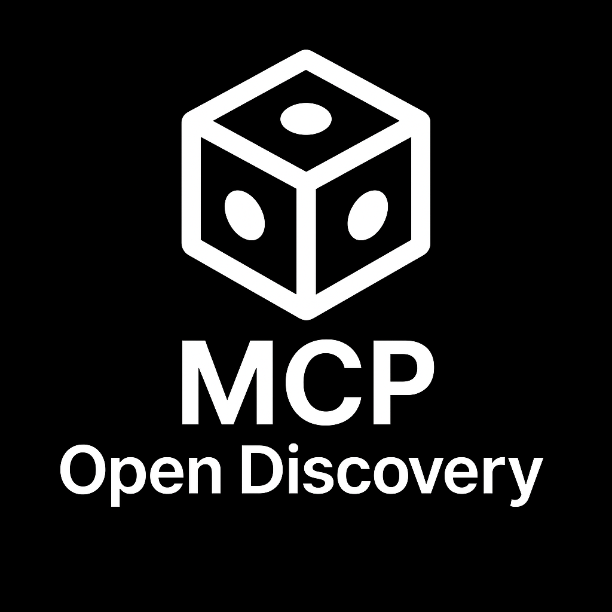

# MCP Open Discovery v2.0 — Executive One‑Pager

## What it is

A production-ready Model Context Protocol (MCP) server that unifies infrastructure discovery, lightweight CMDB, and tool orchestration. Built on the official MCP SDK with a dynamic tool registry and container-first deployment.

## Why it matters

- Accelerates infra visibility and inventory with minimal setup
- Centralizes discovery/monitoring actions behind a single secure endpoint
- Reduces operational toil via hot‑reload tools and persistent CMDB
- Enterprise security: encrypted credentials, audit trails, least privilege

## Key capabilities

- 57+ tools across Network, SNMP, Proxmox, Zabbix, Nmap, Credentials, Memory (CMDB)
- Dynamic registry with hot‑reload (no restarts for updates)
- SQLite-backed CMDB: hierarchical CI keys, relationships, auto-save
- Multi-transport MCP server: HTTP, stdio; AMQP evaluated; container-first

## Architecture at a glance

- Main server: single MCP instance; centralized tool registry
- Persistence: encrypted credentials + SQLite CMDB
- Capability-based security for privileged scans (no root)
- Health endpoint and structured logs for ops

## Security & compliance

- AES-256 encrypted credentials with audit logging
- Input validation (Zod), defensive error handling
- Capability-based Docker security (NET_RAW, NET_ADMIN, NET_BIND_SERVICE)
- Designed for least privilege; supports at-rest encryption policies

## Deployment & operations

- Standard Docker Compose (`docker/docker-compose.yml`); Windows PowerShell script provided (`rebuild_deploy.ps1`). Minimal production server scripts: Windows `rebuild_deploy_prod.ps1` and Linux `rebuild_redeploy_prod.sh` with flags to enable transports (`-Http`/`--http`, `-Amqp`/`--amqp`, `-Stdio`/`--stdio`) and optional RabbitMQ (`-WithRabbitMq`/`--with-rabbitmq`). Use `-ProjectName`/`--project-name` to scope the Compose project safely.
- Health checks and logs; hot‑reload for safe iteration
- Works locally, in CI, or in container platforms

## Proof points

- 93% overall tool success across 57 tools (several categories at 100%)
- Validated against real Proxmox clusters, SNMP devices, and Zabbix
- Persistent CMDB survives restarts; dynamic registry managed at runtime

## Get started

- Run the provided PowerShell script on Windows: `rebuild_deploy.ps1` (full/dev stack) or `rebuild_deploy_prod.ps1` (minimal production).
- Hit the health endpoint on port 3000 and list tools via MCP
- Add credentials to connect Proxmox/SNMP/Zabbix and start discovery

---

Small print: This project was substantially coded with AI under human guidance and review. See README for full details, architecture, and security notes.
