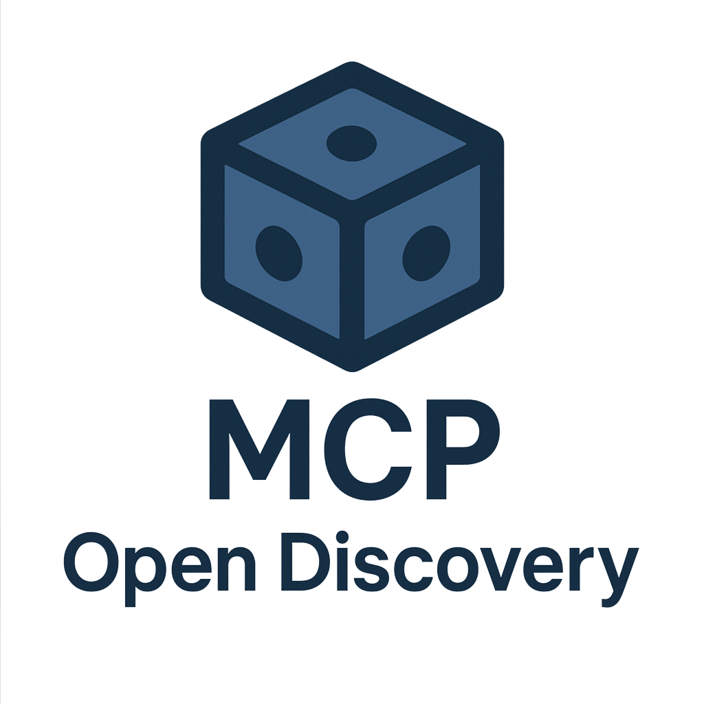

# Usage Examples

> **Note:** The MCP Open Discovery server uses the `MCPOpenDiscoveryServer` class (see `mcp_server.js`) and includes an in-memory CMDB for storing and querying Proxmox cluster, node, VM, container, storage, and network data. See `README.md` and `MCP_COMPLIANCE.md` for details.
>
> **Proxmox API Examples:**
>
> - List nodes, VMs, containers, storage, and networks in a Proxmox cluster
> - Add, list, and remove Proxmox API credentials for secure multi-cluster support
>
> See below for Proxmox-specific usage examples.

## Proxmox API Usage Examples (MCP JSON-RPC)

All examples assume the server is running on `http://localhost:3000` and you have already added credentials with `proxmox_creds_add` (see README for details).

### List Proxmox Nodes

```powershell
Invoke-RestMethod -Uri http://localhost:3000 -Method Post -ContentType 'application/json' -Body '{
  "jsonrpc": "2.0",
  "method": "tools/call",
  "params": {
    "name": "proxmox_list_nodes",
    "arguments": { "creds_id": "proxmox1" }
  },
  "id": "proxmox-nodes-1"
}'
```

### Get Proxmox Node Details

```powershell
Invoke-RestMethod -Uri http://localhost:3000 -Method Post -ContentType 'application/json' -Body '{
  "jsonrpc": "2.0",
  "method": "tools/call",
  "params": {
    "name": "proxmox_get_node_details",
    "arguments": { "node": "ccctc16gb01", "creds_id": "proxmox1" }
  },
  "id": "proxmox-node-details-1"
}'
```

### List VMs for a Node

```powershell
Invoke-RestMethod -Uri http://localhost:3000 -Method Post -ContentType 'application/json' -Body '{
  "jsonrpc": "2.0",
  "method": "tools/call",
  "params": {
    "name": "proxmox_list_vms",
    "arguments": { "node": "ccctc16gb01", "creds_id": "proxmox1" }
  },
  "id": "proxmox-vms-1"
}'
```

### Add Proxmox Credentials

```powershell
Invoke-RestMethod -Uri http://localhost:3000 -Method Post -ContentType 'application/json' -Body '{
  "jsonrpc": "2.0",
  "method": "tools/call",
  "params": {
    "name": "proxmox_creds_add",
    "arguments": {
      "id": "proxmox1",
      "hostname": "proxmox.example.com",
      "username": "root@pam",
      "password": "yourpassword"
    }
  },
  "id": "proxmox-creds-add-1"
}'
```

### List Proxmox Credentials

```powershell
Invoke-RestMethod -Uri http://localhost:3000 -Method Post -ContentType 'application/json' -Body '{
  "jsonrpc": "2.0",
  "method": "tools/call",
  "params": {
    "name": "proxmox_creds_list",
    "arguments": {}
  },
  "id": "proxmox-creds-list-1"
}'
```

## API Usage Examples

All examples assume the server is running on `http://localhost:3000`.

### Ping a Host

```bash
curl -X POST http://localhost:3000 \
  -H "Content-Type: application/json" \
  -d '{
    "method": "tools/call",
    "params": {
      "name": "ping",
      "arguments": {
        "host": "google.com",
        "count": 3,
        "timeout": 5
      }
    }
  }'
```

### DNS Lookup

```bash
curl -X POST http://localhost:3000 \
  -H "Content-Type: application/json" \
  -d '{
    "method": "tools/call",
    "params": {
      "name": "nslookup",
      "arguments": {
        "domain": "example.com",
        "type": "MX"
      }
    }
  }'
```

### Download with wget

```bash
curl -X POST http://localhost:3000 \
  -H "Content-Type: application/json" \
  -d '{
    "method": "tools/call",
    "params": {
      "name": "wget",
      "arguments": {
        "url": "https://httpbin.org/json",
        "timeout": 10,
        "tries": 2
      }
    }
  }'
```

### Test Port Connectivity (Telnet)

```bash
curl -X POST http://localhost:3000 \
  -H "Content-Type: application/json" \
  -d '{
    "method": "tools/call",
    "params": {
      "name": "telnet",
      "arguments": {
        "host": "google.com",
        "port": 80
      }
    }
  }'
```

### Nmap Ping Scan

```bash
curl -X POST http://localhost:3000 \\
  -H "Content-Type: application/json" \\
  -d '{
    "method": "tools/call",
    "params": {
      "name": "nmap_ping_scan",
      "arguments": {
        "target": "scanme.nmap.org"
      }
    }
  }'
```

### Nmap TCP SYN Scan

```bash
curl -X POST http://localhost:3000 \\
  -H "Content-Type: application/json" \\
  -d '{
    "method": "tools/call",
    "params": {
      "name": "nmap_tcp_syn_scan",
      "arguments": {
        "target": "scanme.nmap.org",
        "ports": "80,443"
      }
    }
  }'
```

### Nmap TCP Connect Scan

```bash
curl -X POST http://localhost:3000 \\
  -H "Content-Type: application/json" \\
  -d '{
    "method": "tools/call",
    "params": {
      "name": "nmap_tcp_connect_scan",
      "arguments": {
        "target": "scanme.nmap.org",
        "ports": "22,80"
      }
    }
  }'
```

### Nmap UDP Scan

```bash
curl -X POST http://localhost:3000 \\
  -H "Content-Type: application/json" \\
  -d '{
    "method": "tools/call",
    "params": {
      "name": "nmap_udp_scan",
      "arguments": {
        "target": "scanme.nmap.org",
        "ports": "53,161"
      }
    }
  }'
```

### Nmap Version Detection

```bash
curl -X POST http://localhost:3000 \\
  -H "Content-Type: application/json" \\
  -d '{
    "method": "tools/call",
    "params": {
      "name": "nmap_version_scan",
      "arguments": {
        "target": "scanme.nmap.org",
        "ports": "21,22,80"
      }
    }
  }'
```

## Note on Test Scripts

As of June 5, 2025, all legacy test scripts and test result files have been archived to the `archive/` directory. See `archive/test_tools_cleanup_2025-06-05.txt` for details. These are no longer maintained in the main project.

## Further Information

For comprehensive details on installation, configuration, all available tools (including BusyBox and Nmap), security considerations, and troubleshooting, please consult the main [README.md](../README.md).
